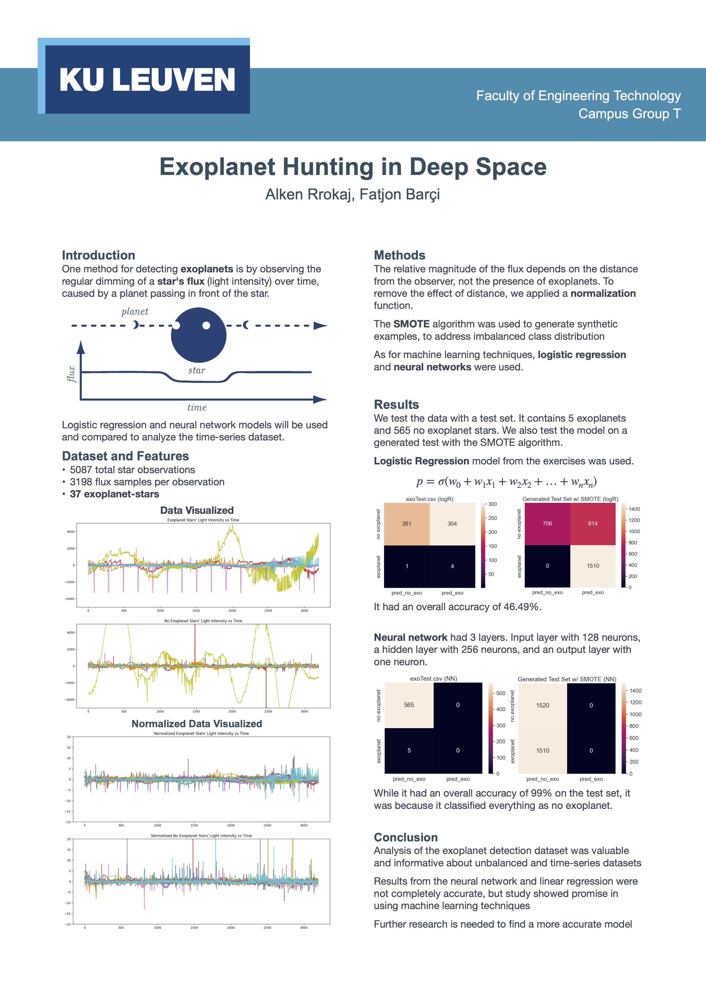

# **ML Project: Exoplanet Hunting in Deep Space**
**Alken Rrokaj, Fatjon Barçi**

### Motivation:
Exoplanet hunting in deep space is done by tracking a star over several months or years, to observe if there is a regular 'dimming' of the flux (the light intensity). This is light dimming, is evidence that there may be an orbiting body around the star, such as a planet. This star could be considered to be a 'candidate' system for further depth observations, for example by a satellite that captures light at a different wavelength, could solidify the belief that the candidate can in fact be 'confirmed'. Using a machine learning model is probably the only logical method of making this tedious task possible. 

### Dataset Description: 
[Exoplanet Hunting in Deep Space](https://www.kaggle.com/datasets/keplersmachines/kepler-labelled-time-series-data)
* Column 1 is the label vector. 
* Columns 2 - 3198 are the flux values over time.

### Trainset:
* 5087 rows or observations.
* 3198 columns or features. 
* 37 confirmed exoplanet-stars and 5050 non-exoplanet-stars.

### Testset:
* 570 rows or observations.
* 3198 columns or features.
* 5 confirmed exoplanet-stars and 565 non-exoplanet-stars.

## **Poster**

## Paper is available [here](/Paper.pdf)
